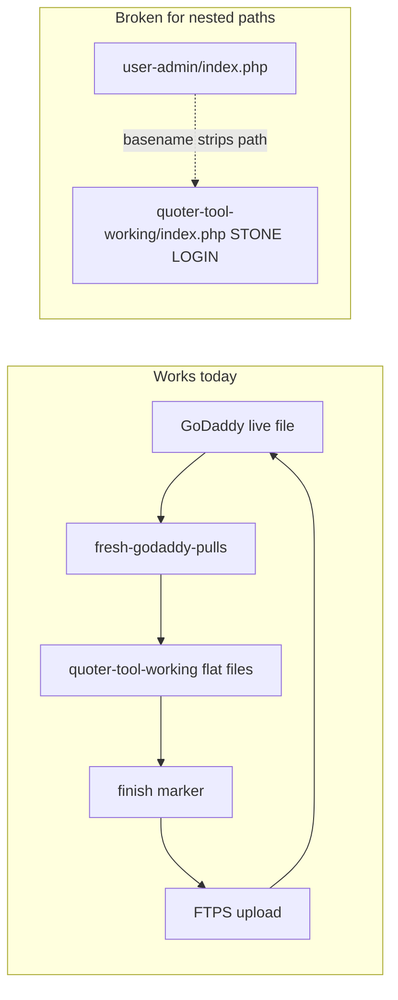

# OGM Workflow & Wiring Audit

**Saved:** 2026-06-14  
**Status:** Implemented locally 2026-06-17 — quoter changes finished, not uploaded  
**Rollback:** [dev-tools/snapshots/2026-06-14-pre-workflow-audit/RESTORE.md](../snapshots/2026-06-14-pre-workflow-audit/RESTORE.md)

Workflow-focused audit of API Access, DXF zones, and `ogm-workflow.sh` — overwrite risks, broken path handling, partial-deploy traps, and disconnected feature wiring.

---

## Executive summary

The biggest risks are **not in the feature code itself** but in **how files move through the edit pipeline**: nested paths collide on `index.php`, multi-file features can be half-deployed, and re-running `start` silently discards unsaved work. Recent API Access and DXF work are mostly wired correctly on the server, but the local workflow script has gaps that already caused real friction (`user-admin/index.php` finish/upload failure).



---

## Implementation checklist

- [x] Fix `ogm-workflow.sh` + finish markers to preserve nested paths (`user-admin/index.php`, `website-leads/*`) and prevent basename collision with Stone `index.php`
- [x] Add pre-overwrite backup/warning when `start` would replace a modified working file
- [x] Add `dev-tools/task-bundles/` manifests + `bundle-finish` / `bundle-upload` helpers for multi-file features (API Access, DXF, Hub)
- [x] Load `ogm-dxf-classify.js` in `OGM_KitchenPlanner.html` for standalone DXF zones
- [x] Fix `OGM_BlueprintScanner.html` hub link (`hub.php`) and `customer-ai-api.php` stale "Email Settings" error text
- [x] Wire `OGM_SSD_BACKUPS` for external SSD pre/post-edit copies (Crucial X10, 2026-06-17)
- [ ] Run live smoke-test checklist (below) after GoDaddy upload

---

## Critical — can overwrite or destroy the wrong file

### 1. `ogm-workflow.sh` strips directory paths (`basename`)

`dev-tools/scripts/ogm-workflow.sh` lines 143–147:

```bash
pulled="$pull_dir/$(basename "$remote_file")"
cp "$pulled" "$WORKING/$(basename "$remote_file")"
```

**Impact:** `start user-admin/index.php` or `start website-leads/index.php` copies into `quoter-tool-working/index.php` — the **Stone login shell**, not the nested admin file. This can:

- Wipe in-progress Stone login edits
- Cause `finish user-admin/index.php` to fail (working file not at expected path)
- Force manual FTPS uploads (as happened for API Access Team & Logins hint)

`godaddy-ftps.sh` correctly uploads to nested remote paths, but the **local working copy path is wrong**.

**Fix:** Preserve relative path under `quoter-tool-working/` (e.g. `user-admin/index.php`). Update `finish_marker()` to sanitize slashes (e.g. `user-admin-index.php.ready`). Block or warn when basename collisions would occur.

### 2. Re-running `start` on the same file wipes local edits

No dirty-check before overwrite. If you `start hub.php`, edit, then `start hub.php` again, the fresh pull **replaces** `quoter-tool-working/hub.php` with no backup of the in-progress edit unless you already ran `finish`.

**Fix:** On `start`, if working file exists and differs from pull, write a `.bak-before-restart-*` sidecar and print a loud warning (or require `OGM_FORCE_START=yes`).

### 3. Multi-file features — partial upload leaves live site inconsistent

| Feature | Files that must stay in sync |
|---------|------------------------------|
| **API Access** | `quoter-users.php`, `hub.php`, `OGM_Hub.html`, `api-access.php`, `claude-api-key.php`, `email-api.php`, `email-center.php`, `user-admin/index.php` |
| **DXF zones** | `ogm-dxf-classify.js`, `ogm-quoter-internal.html`, `OGM_KitchenPlanner.html`, `ai-quickstart-config.php` |
| **Hub cards / caps** | `hub.php` injects `OGM_HUB_CAPS`; `OGM_Hub.html` holds card markup/visibility JS |

**Fix:** Add optional task manifests, e.g. `dev-tools/task-bundles/api-access.txt`, and `ogm-workflow.sh bundle-finish <bundle>` / `bundle-upload`.

---

## High — disconnected or incorrectly wired

### 4. Kitchen Planner standalone DXF zones depend on parent quoter

`OGM_KitchenPlanner.html` does **not** load `ogm-dxf-classify.js`. Zone/cutout import calls `parentWin.ogmDxfParseAndClassify`.

- **Works:** DXF import from Stone quoter design view (iframe parent has the script)
- **Fails / falls back:** Kitchen Planner opened directly (e.g. from `OGM_BlueprintScanner.html`) — no multi-room zones

**Fix:** Add `<script src="ogm-dxf-classify.js">` to Kitchen Planner, or document quoter-only zone import.

### 5. Hub entry inconsistency

`OGM_BlueprintScanner.html` links to `OGM_Hub.html`, which is **denied** by `.htaccess`. Users get blocked instead of the Hub.

**Fix:** Change Blueprint Scanner nav to `hub.php`.

### 6. Stale user-facing error text

`customer-ai-api.php` still says "Set it in Email Settings" when the key is missing. Key management moved to `api-access.php`.

**Fix:** Update error string to "API Access".

### 7. `finish` / `upload` task-slug mismatch

Markers are keyed as `{task}-{filename}.ready`. Mismatched slugs block upload even when the file is ready.

**Fix:** Document slug discipline; optionally allow upload if any finish marker exists for that filename.

---

## Medium — process & two-computer safety

### 8. Server-only data never flows through workflow (by design)

| Data | Location |
|------|----------|
| Team logins / permissions | `public_html/tmp/ogm-quoter/users.json` |
| Claude API key | `quoter-tool/.data/email/claude-api-key.json` |
| Email OAuth tokens | `.data/email/tokens/` |

Deploying `quoter-users.php` triggers schema v4 migration on first live request. No API key reload needed if `.data/email/claude-api-key.json` already exists.

### 9. GitHub backups off by default

Set `OGM_GITHUB_BACKUP=yes` in `.env.local` for dated pre/post-edit snapshots in `github-backups/`.

### 10. DXF rules duplicated in PHP and JS

- Browser: `ogm-dxf-classify.js` — red=zone (ACI 1), green=cutout (ACI 3)
- Server: `ai-quickstart-config.php` — same rules today

**Risk:** Future changes in one file only → Quick Start and Stone quoter disagree. Document "change both" in [dxf-cad-export-sop.md](./dxf-cad-export-sop.md).

### 11. Cache busting for new JS

`ogm-quoter-internal.html` loads `ogm-dxf-classify.js?v=20260616`. Bump query string after JS updates.

---

## Low — already working as intended

- API key storage shared across Email AI, Quick Start, Customer AI (`.data/email/claude-api-key.json`)
- `api_access` permission not blanket-granted to all GMs
- Hub visibility via `OGM_HUB_CAPS` from `hub.php`
- Team & Logins UI picks up `api_access` from `qtPermissionLabels()`

---

## Recommended fix order

1. Fix nested-path handling in `ogm-workflow.sh`
2. Add `start` dirty-file warning
3. Add task bundle manifests
4. Wire Kitchen Planner standalone OR document limitation
5. Quick copy/nav fixes (Blueprint Scanner, Customer AI error text)
6. Optional: enable `OGM_GITHUB_BACKUP=yes`

---

## Smoke-test checklist (live, post-deploy)

- Tanya → `hub.php` → API Access card visible → save/validate key
- Brennan → no card; direct `api-access.php` → 403
- Team & Logins → `api_access` checkbox for Sed/Tanya/Meo
- Email Center → API Access button + missing-key banner when appropriate
- Stone quoter → multi-red-zone DXF → multiple rooms + green cutouts
- Kitchen Planner **inside quoter** → same DXF behavior
- Kitchen Planner **standalone** → confirm expected behavior (legacy vs zones)
